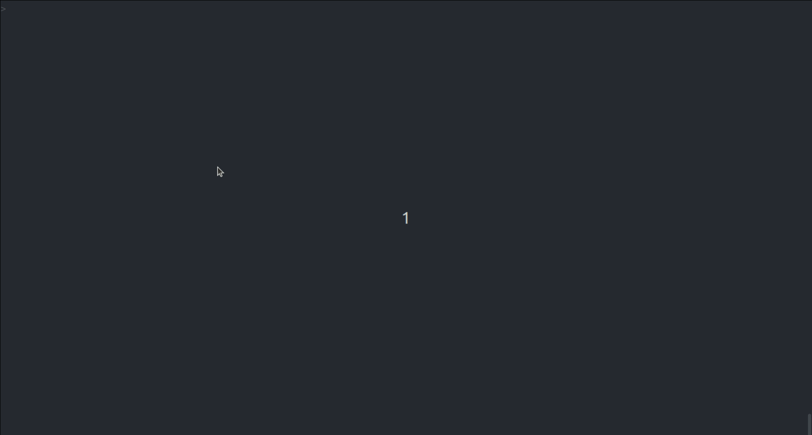
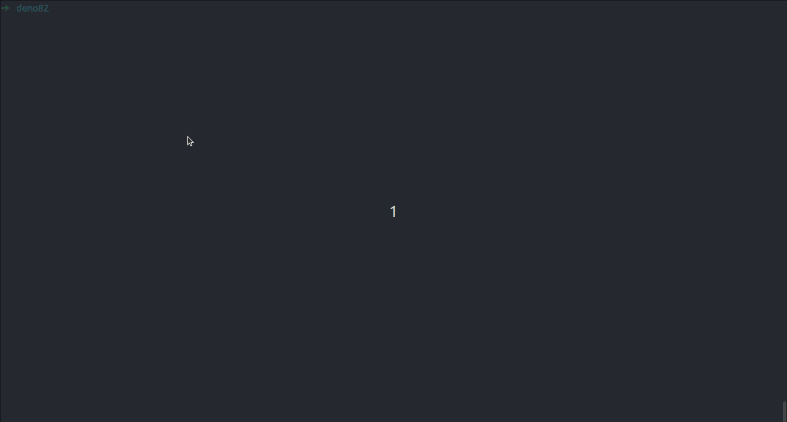
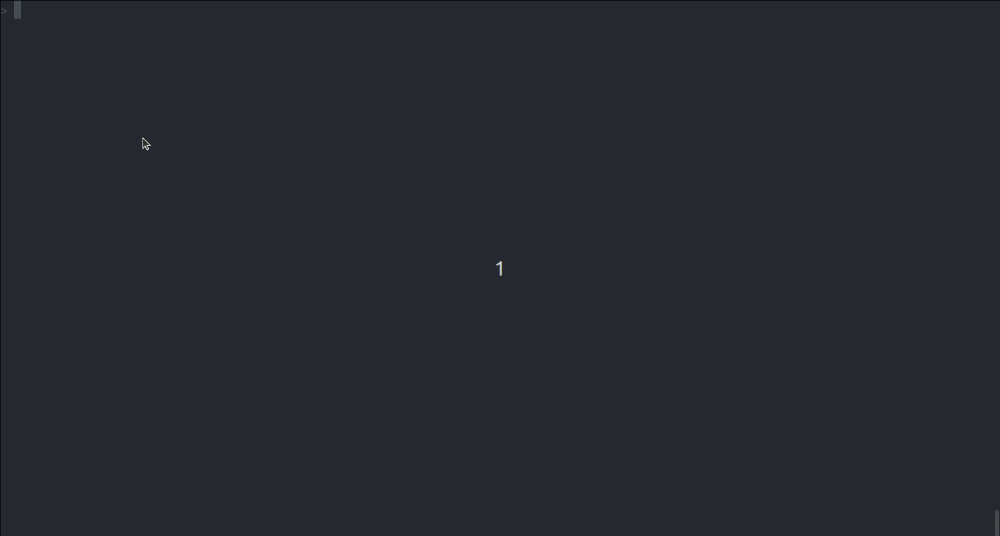
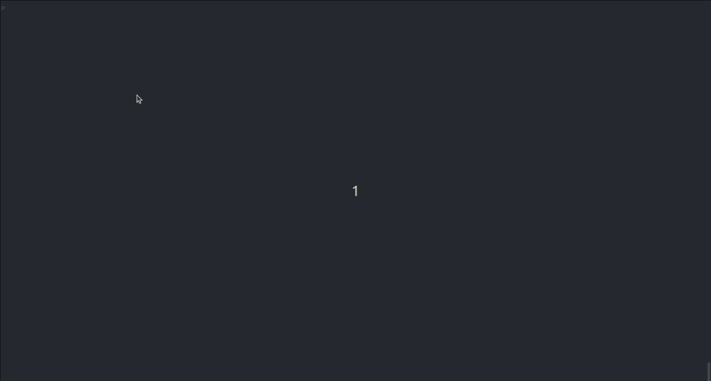

# pSym
A REPL for Symfony and PHP

**pSym** works both inside and outside Symfony project. When used within a Symfony project, it provides additional
features such as access to variables like `$kernel`, `$container`, `$doctrine`, and `$em`.
Additionally, all registered **project commands** become accessible as well.

The `lse` command and `table()`, `sql()` functions are available when **Doctrine** is installed.

Function `html()` and features like `auto-completion`, `auto-suggestion`, and `doc-and-signature` work **universally**.

## Installation
To install pSym, create a project using `composer create-project` in your preferred location. If you have
multiple PHP versions on your machine, install it on the **lowest** version. It supports PHP versions `>=7.2`
and works with Symfony versions `4`, `5`, `6`, and `7`.
```shell
# The home directory might be an ideal place to install
cd ~
composer create-project tareqas/psym psym
```
Next, add the `your-psym-installation-path/psym/bin/` directory to your system's PATH, so you can run the
`psym` command directly from your shell.

> **Warning:** Do not install it as a global or local package; it won't work.

### Commands
```shell
# list all the commands, including your project commands.
list
# or
?
```

### Auto-complete and Auto-suggestion


To get suggestions, press the `TAB` key.

> **Note:** Sometimes you may need to press `SPACE` first and then `TAB`.

```shell
# press TAB for suggestion
$kernel->
# it also works with method chaining
$kernel->getBundle()-> 
# press TAB for completion
$kernel->getBund
```

### Documentation and Signature


You can view PHPDoc documentation and signature for `function`, `property`, and `method`.
```shell
# press TAB to display the phpDoc and signature for getBundle
$kernel->getBundle 
```

### lse


The `lse` command lists all entities managed by Doctrine.
```shell
# list of of all matching tables
lse ca
# list all properties, columns, types, and default values of an entity
lse cart
# list of all matching properties for the 'cart' entity
lse cart tot
```

### html()
```php
function html(...$vars): void
```
The `html()` function dumps variables and renders them as a browsable HTML page. If any of your variables contain
Doctrine objects, it will automatically instantiate all proxy objects.

You can fine-tune the dump by providing additional options in the last parameter as an associative array:
```php
html($var, [
    'nestedLevel' => -1, # or 'level' - how deep it should go to instantiate doctrine proxy object
    'collectionSize' => 1, # or 'size' - cut the Doctrine association collection to this specific size
    'maxString' => -1 # # cut the overlong string to this specific size
])
# -1 implies that there is no limit.
```

### table()
```php
function table(string $table, ?string $alias = null): EntityRepository|QueryBuilder|void
```
The `table()` function retrieves a repository for a given entity. It returns a `Doctrine\ORM\EntityRepository`
if no alias is provided, or a `Doctrine\ORM\QueryBuilder` if an alias is specified.

### sql()


```php
function sql(string $sql, array $params = []): array|void
```
The `sql()` function executes raw SQL queries and returns the result as an associative array.
Doctrine is required to use this feature.
```shell
# press TAB to display all available tables
sql('select * from '
# press TAB to display all available columns in the 'cart' table
sql('select c. from cart c'
```

### dql()


```php
function dql(string $dql, array $params = []): array|void
```
The `dql()` function allows you to execute DQL queries and also returns the result as an associative array.
```shell
# press TAB to display all available entities
dql('select * from '
# press TAB to display all available properties in the 'Cart' entity
sql('select c. from App\Entity\Cart c'
```
> **Limitation:** Auto-completion may have limitations with entity classes due to backslashes (\\).
> Other features work as expected.

## And more
To unlock the full potential, explore the [PsySH documentation](https://psysh.org/#docs). pSym is built on top of PsySH.
